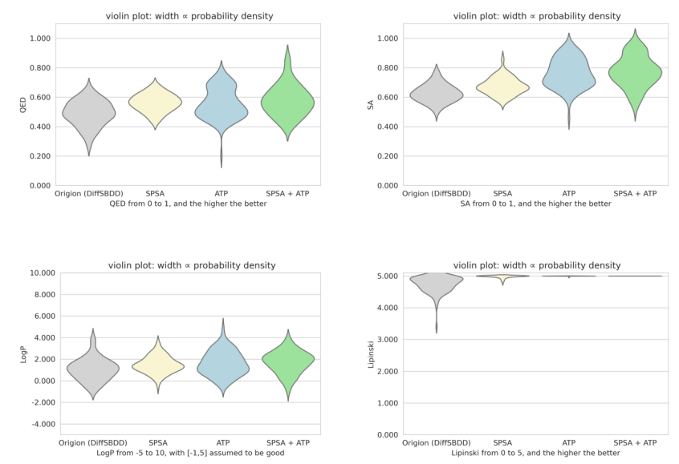
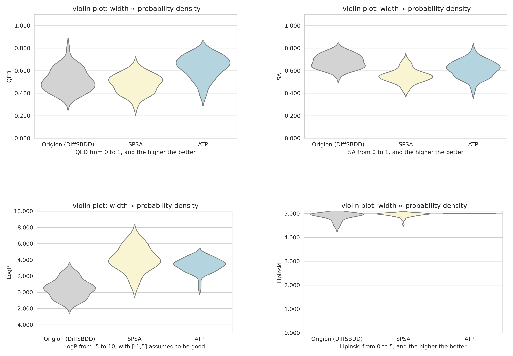
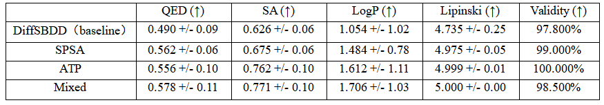
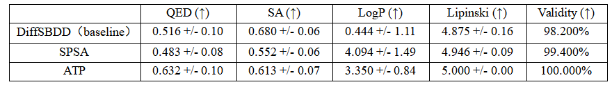

# DiffNDM: Diffusion model based drug design guided by non-differentiable metrics.

This study proposes two plug-and-play optimization strategies that can be seamlessly integrated into existing diffusion models (DiffSBDD). GitHub repository: [https://github.com/arneschneuing/DiffSBDD](https://github.com/arneschneuing/DiffSBDD).

### Proposed Methods

1. **Zero-order Optimization via Gradient Approximation (SPSA)**  
   This strategy applies symmetric multi-scale noise perturbations to intermediate samples and estimates gradient direction using finite differences of comprehensive metrics. The estimated gradient is then incorporated as a guidance term into the sample mean update of the original diffusion model.

2. **Adaptive Trajectory Pruning (ATP)**  
   This approach dynamically selects sub-trajectories with higher metric scores and structural stability by simultaneously sampling multiple candidate samples during the denoising process, combined with a multi-step lookahead denoising strategy for sample evaluation.

### Implementation & Evaluation

We integrated both methods individually and in combination into the existing [DiffSBDD framework](https://drive.google.com/drive/folders/1CzwxmTpjbrt83z_wBzcQncq84OVDPurM). Comparative experiments were conducted on the CrossDocked dataset against baseline models across various drug design metrics.

### Results

Experimental results demonstrate that our methods significantly improve:
- Molecular validity rates
- Performance on non-differentiable drug design metrics

### Contributions

This work provides novel insights for:
- Non-differentiable metric-guided molecular generation
- Structure-based drug design using diffusion models

The proposed strategies show substantial theoretical value and practical potential for diffusion-based drug design frameworks.
