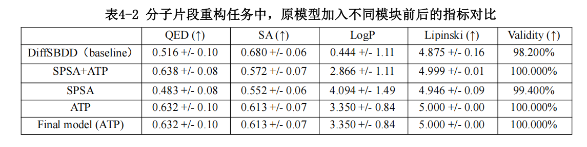

The main text of the paper can be found at:  [基于不可微指标引导扩散模型的结构药物设计.pdf](蔡逸凡-2021533087-基于不可微指标引导扩散模型的结构药物设计.pdf)

# DiffNDM: Diffusion model based drug design guided by non-differentiable metrics.

   Structure-Based Drug Design (SBDD) is a methodology that use the three-dimensional
structural information of protein binding pockets to design high-affinity targeted small-molecule
drug ligands. In recent years, diffusion models like DiffSBDD (Diffusion model for Structure
based drug design) have demonstrated considerable potential in this area due to their strong
transferability and high controllability. These algorithms abstract the task as a three-dimensional
conditional probability modeling problem, enabling protein pocket-specific molecular generation. However, traditional drug design evaluation metrics (e.g., Quantitative Estimate of Drug-likeness, QED, and Synthetic Accessibility, SA) are often non-differentiable, which makes it difficult for
diffusion models to directly optimize candidate molecules' drug properties through gradient-based
updates during denoising steps. This problem significantly limits the quality of generated
molecules in terms of key pharmacological characteristics. 

   In order to handle this problem, we propose a plug-and-play optimization algorithm, which is
constructed by two basic thoughts: the Simultaneous Perturbation Stochastic Approximation
(SPSA)-based gradient approximation method, and the Adaptive Trajectory Pruning (ATP)
method. In order to validate the effectiveness of the proposed method, we integrated the strategy
into the baseline DiffSBDD and conducted systematic comparisons on the CrossDocked dataset. The results demonstrated that our approach significantly improves both molecular validity and
scores of multiple non-differentiable drug metrics. These findings indicate that the proposed
strategy offers a novel framework for the non-differentiable metric guided molecular generation, which holds substantial theoretical value and practical potential for structure-based drug design.

### Proposed Methods

1. **Zero-order Optimization via Gradient Approximation (SPSA)**  
   This strategy applies symmetric multi-scale noise perturbations to intermediate samples and estimates gradient direction using finite differences of comprehensive metrics. The estimated gradient is then incorporated as a guidance term into the sample mean update of the original diffusion model. On this foundational concept, I have implemented three innovative improvements: a multiple perturbation averaging strategy, multi-scale perturbation ζ, and reinforcement learning-based perturbation optimization.

2. **Adaptive Trajectory Pruning (ATP)**  
   This approach dynamically selects sub-trajectories with higher metric scores and structural stability by simultaneously sampling multiple candidate samples during the denoising process, combined with a multi-step lookahead denoising strategy for sample evaluation.

### Implementation & Evaluation

We integrated both methods individually and in combination into the existing [DiffSBDD framework](https://drive.google.com/drive/folders/1CzwxmTpjbrt83z_wBzcQncq84OVDPurM). Comparative experiments were conducted on the CrossDocked dataset against baseline models across various drug design metrics.

### Results

Experimental results demonstrate that our methods significantly improve:
- Molecular validity rates
- Performance on non-differentiable drug design metrics
  
# DiffSBDD Conditional Generation Results

# DiffSBDD inpaint Generation Results 

# DiffSBDD Conditional Generation Table

# DiffSBDD inpaint Generation Table


### Contributions

This work provides novel insights for:
- Non-differentiable metric-guided molecular generation
- Structure-based drug design using diffusion models

The proposed strategies show substantial theoretical value and practical potential for diffusion-based drug design frameworks.

## Implementation Details

This work can be seamlessly integrated with DiffSBDD checkpoints. The pretrained model can be downloaded from:  
[https://zenodo.org/records/8183747](https://zenodo.org/records/8183747)  
and should be placed at `/checkpoints/crossdocked_fullatom_cond.ckpt`.

### Dataset Preparation
We utilize the CrossDocked dataset, with preprocessing methods detailed in the original DiffSBDD paper:  
[https://github.com/arneschneuing/DiffSBDD?tab=readme-ov-file](https://github.com/arneschneuing/DiffSBDD?tab=readme-ov-file)

For convenience, we provide a preprocessed version at: `my_new_data/processed_crossdock_noH_full_temp.zip` which can be directly extracted and used.

### Model Components
1. **Newly Trained Components**  
   Our small perturbation prediction neural network checkpoint is available at:  
   `/RL_check_point`

2. **RL Training Capability**  
   The reinforcement learning network supports online training during generation - checkpoint information will be automatically updated after each molecular generation and scoring cycle.

### Result Examples
We provide sample outputs for each task in the following directories (directly extractable):
- `my_example_ATP/60_15_100_o.zip` 
- (Other example folders...) e.t.c.

## Basic Usage

### Standard Protein-Ligand Generation
For conventional protein pocket ligand generation tasks, run:
```bash
python <path-to-file>/my_test.py --output_folder <path-to-folder> --ATP 0 --SPSA 0 e.t.c.
```

Note: Parameters can be modified directly in my_test.py

--operate_file: path to generate_ligands.py

--checkpoint: path to checkpoint (eg: /checkpoints/crossdocked_fullatom_cond.ckpt)

--input_folder: pth to dataset (eg: /my_new_data/processed_crossdock_noH_full_temp/test)

--output_folder: folder to save .sdf

--ATP: {0,1} whether use ATP method

--SPSA: {0,1} whether use SPSA method

--optimize: {0,1} whether automatically updated RL checkpoint after each molecular generation and scoring cycle. if 1: --path PATH: the begining checkpoint of RL --path_save: where to save the updated RL checkpoint (you can make it None)

### Inpainting Tasks
For inpainting tasks, execute:
```bash
python <path-to-file>/my_test_inpaint.py --output_folder <path-to-folder> --ATP 0 e.t.c.
```

Parameters can be adjusted in my_test_inpaint.py
--operate_file: path to inpaint.py

--checkpoint: path to checkpoint

--input_folder: path to dataset  

--output_folder: folder to save .sdf

--fix_atoms: path to fixed atom folder (you can directly extracted fix_ligand.zip)

--center: {ligand,pocket}

--add_n_nodes: how many nodes to generate

--ATP: {0,1} whether use ATP method (if 0, back to DiffSBDD)

--timesteps: whole timesteps             

--resamplings: resampling each step

--n_samples: how many samples per pocket

### Evaluation Metrics
To compute evaluation metrics:
```bash
python <path-to-file>/my_new_evaluate.py <path-to-output_folder> out.txt
```
