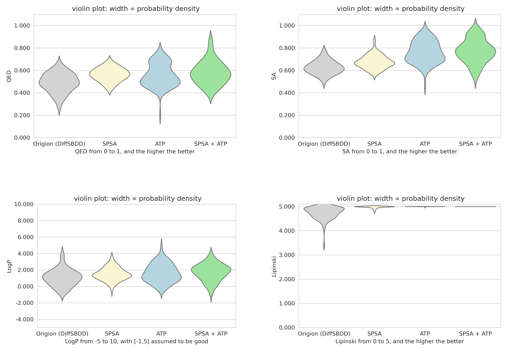

# DiffNDM: Diffusion model based drug design guided by non-differentiable metrics.

This study proposes two plug-and-play optimization strategies that can be seamlessly integrated into existing diffusion models (DiffSBDD). GitHub repository: [https://github.com/arneschneuing/DiffSBDD](https://github.com/arneschneuing/DiffSBDD).

### Proposed Methods

1. **Zero-order Optimization via Gradient Approximation (SPSA)**  
   This strategy applies symmetric multi-scale noise perturbations to intermediate samples and estimates gradient direction using finite differences of comprehensive metrics. The estimated gradient is then incorporated as a guidance term into the sample mean update of the original diffusion model.

2. **Adaptive Trajectory Pruning (ATP)**  
   This approach dynamically selects sub-trajectories with higher metric scores and structural stability by simultaneously sampling multiple candidate samples during the denoising process, combined with a multi-step lookahead denoising strategy for sample evaluation.

### Implementation & Evaluation

We integrated both methods individually and in combination into the existing [DiffSBDD framework](https://drive.google.com/drive/folders/1CzwxmTpjbrt83z_wBzcQncq84OVDPurM). Comparative experiments were conducted on the CrossDocked dataset against baseline models across various drug design metrics.

### Results

Experimental results demonstrate that our methods significantly improve:
- Molecular validity rates
- Performance on non-differentiable drug design metrics
  
# DiffSBDD Conditional Generation Results

# DiffSBDD inpaint Generation Results 

# DiffSBDD Conditional Generation Table

# DiffSBDD inpaint Generation Table


### Contributions

This work provides novel insights for:
- Non-differentiable metric-guided molecular generation
- Structure-based drug design using diffusion models

The proposed strategies show substantial theoretical value and practical potential for diffusion-based drug design frameworks.

## Implementation Details

This work can be seamlessly integrated with DiffSBDD checkpoints. The pretrained model can be downloaded from:  
[https://zenodo.org/records/8183747](https://zenodo.org/records/8183747)  
and should be placed at `/checkpoints/crossdocked_fullatom_cond.ckpt`.

### Dataset Preparation
We utilize the CrossDocked dataset, with preprocessing methods detailed in the original DiffSBDD paper:  
[https://github.com/arneschneuing/DiffSBDD?tab=readme-ov-file](https://github.com/arneschneuing/DiffSBDD?tab=readme-ov-file)

For convenience, we provide a preprocessed version at:  
`my_new_data/processed_crossdock_noH_full_temp.zip`  
which can be directly extracted and used.

### Model Components
1. **Newly Trained Components**  
   Our small perturbation prediction neural network checkpoint is available at:  
   `/RL_check_point`

2. **RL Training Capability**  
   The reinforcement learning network supports online training during generation - checkpoint information will be automatically updated after each molecular generation and scoring cycle.

### Result Examples
We provide sample outputs for each task in the following directories (directly extractable):
- `my_example_ATP/60_15_100_o.zip` 
- (Other example folders...) e.t.c.

## Basic Usage

### Standard Protein-Ligand Generation
For conventional protein pocket ligand generation tasks, run:
```bash
python <path-to-file>/my_test.py --output_folder <path-to-folder> --svdd 0 --SPSA 0 
```

Note: Parameters can be modified directly in my_test.py

--operate_file: path to generate_ligands.py

--checkpoint: path to checkpoint (eg: /checkpoints/crossdocked_fullatom_cond.ckpt)

--input_folder: pth to dataset (eg: /my_new_data/processed_crossdock_noH_full_temp/test)

--output_folder: folder to save .sdf

--ATP: {0,1} whether use ATP method

--SPSA: {0,1} whether use SPSA method

--optimize: {0,1} whether automatically updated RL checkpoint after each molecular generation and scoring cycle. if 1: --path PATH: the begining checkpoint of RL --path_save: where to save the updated RL checkpoint (you can make it None)

### Inpainting Tasks
For inpainting tasks, execute:
```bash
python <path-to-file>/my_test_inpaint.py --output_folder <path-to-folder> --ATP 0 e.t.c.
```

Parameters can be adjusted in my_test_inpaint.py
--operate_file: path to inpaint.py

--checkpoint: path to checkpoint

--input_folder: path to dataset  

--output_folder: folder to save .sdf

--fix_atoms: path to fixed atom folder (you can directly extracted fix_ligand.zip)

--center: {ligand,pocket}

--add_n_nodes: how many nodes to generate

--ATP: {0,1} whether use ATP method (if 0, back to DiffSBDD)

--timesteps: whole timesteps             

--resamplings: resampling each step

--n_samples: how many samples per pocket

### Evaluation Metrics
To compute evaluation metrics:
```bash
python <path-to-file>/my_new_evaluate.py <path-to-output_folder> out.txt
```
